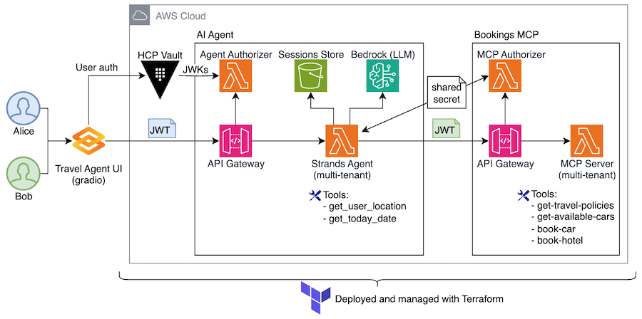
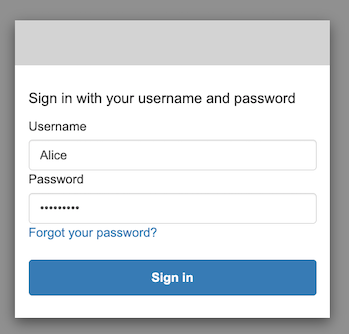
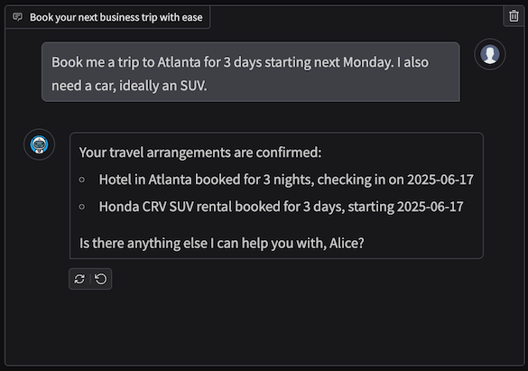

# AI Agent with MCP Server on AWS Lambda

This repo contains a sample implementation of user-aware AI Agent and MCP Server running on [AWS Lambda](https://aws.amazon.com/lambda). The sample implements an AI-based Travel Agent for a fictitious corporation AcmeCorp.


See two below artifacts to better understand the expected Agent behavior. 
* [./lambdas/travel-agent/agent_builder.py](./lambdas/travel-agent/agent_builder.py) for Agent's system prompt. 
* [./lambdas/bookings-mcp/tool-get-travel-policies.js](./lambdas/bookings-mcp/tool-get-travel-policies.js) for corporate travel policies the Agent is bound by. 

(Skip to [Running the project](#running-the-project))



### Frameworks and services
* AI Agent is implemented using [Strands Agents SDK](https://strandsagents.com/0.1.x/)
* MCP Server is implemented using the [official MCP TypeScript SDK](https://github.com/modelcontextprotocol/typescript-sdk) and [Lambda Web Adapter](https://github.com/awslabs/aws-lambda-web-adapter)
* [Amazon API Gateway](https://aws.amazon.com/api-gateway/) is used to front AI Agent and MCP (see architecture diagram). 
* [Amazon S3](https://aws.amazon.com/s3/) is used to persist AI Agent session state. 
* [Amazon Bedrock](https://aws.amazon.com/bedrock) and Claude Haiku 3.5 are used for inferrence. 
* [Gradio](https://www.gradio.app) is used for Web UI. 

### Authentication and Authorization
* User authentication is handled by [Amazon Cognito](https://aws.amazon.com/cognito/)
* During `terraform apply`/`cdk deploy` two users will be created in the Cognito User Pool - `Alice` and `Bob`. Use these users to login, as described below. 
* Both AI Agent and Bookings MCP domains require JWT (bearer token) authorization, as enforced by API Gateway Lambda authorizers.
* AI Agent expects JWT issued by Cognito. The subject of this JWT is the user. Validation is done in the Agent Authorizer using JWKs generated by Cognito during user authentication.
* Bookings MCP expects JWT generated by Strands Agent. The subject of this JWT is the agent with `user_id` being an extra claim. This token is signed by a shared secret. Validation is done in the MCP Authorizer using shared secret. 
* To state explicitly - at no point in time user's identity is inferred from LLM's response. It is ALWAYS propagated using JWTs. 

### User-awareness and session management
* Both AI Agent and MCP Server are fully stateless, they do not maintain any internal state. 
* Both AI Agent and MCP Server are aware of the current user and process requests within the user authorization context.
* AI Agent externalizes its state to S3, using the [S3SessionManager](https://strandsagents.com/latest/documentation/docs/user-guide/concepts/agents/session-management/#s3sessionmanager) class provided by Strands SDK. 
* New Strands Agent instance is created on every request with state that belongs to the current user. 
* MCP Clients attached to the AI Agent are created per-user, holding user-specific JWT to communicate with MCP Server. 
* MCP Server propagates authorized user context into all tools, making MCP tools user-aware. 

### Tools

#### Implemented in agent
* [Agent] `get-user-location` resolves user's IP address to users location. 
* [Agent] `get-todays-date` tool returns today's date.

#### Implemented in MCP Server
* [MCP] `get-travel-policies` returns AcmeCorp corporate travel policies.
* [MCP] `get-available-cars` returns a list and categories of cars available to rent.
* [MCP] `book-car` books a car rental.
* [MCP] `book-hotel` books a hotel.

## Running the project

> The project is using arm64 architecture by default for better cost efficiency. Update IaC files if you want to change it to x86.  

### Prereqs

* AWS CLI, Git, Docker
* Terraform or CDK
* Node.js installed
* Access to `us.anthropic.claude-3-5-haiku-20241022-v1:0` in `us-east-1`. Or update [Agent configuration](./lambdas/travel-agent/agent_builder.py) to use a different model/region. 

### Clone the project 
```bash
git clone https://github.com/aws-samples/sample-serverless-mcp-servers.git
cd sample-serverless-mcp-servers/strands-agent-on-lambda
```

### Install dependencies
```bash
(cd lambdas/agent-authorizer && npm install)
(cd lambdas/mcp-authorizer && npm install)
(cd lambdas/bookings-mcp && npm install)
```

### Deploy to AWS with CDK or Terraform

Terraform:
```bash
cd terraform 
terraform init
terraform plan
terraform apply
```

CDK:
```bash
npm install
cdk deploy
```

Make sure to carefully review required IAM permissions. 

### Run post-deploy script

Terraform: 
```
# Make sure you're in the {project_root}/terraform directory
./prep-web.sh
cd ..
```

```bash
# Make sure you're in the {project_root}/ directory
./prep-web.sh
```

Running this script will
1. Update Cognito users Alice and Bob with passwords. The password is `Passw0rd@`. You will need it to login. 
2. Update `{project_root}/web/.env` file with configuration required for running Web UI. 

### Run Web UI
```bash
cd web
python3 -m venv .venv             # Create virtual environment
source .venv/bin/activate         # Active virtual environment
pip install -r requirements.txt   # Install dependencies
python app.py                     # Start Web UI app
```

Open `http://localhost:8000/chat/` in your browser

### Login

You will be redirected to Cognito-hosted login screen. 



* Username: `Alice` or `Bob`
* Password: `Passw0rd@`

Once logged in, start asking your AI Agent questions about corporate travel booking, for example

* What cars can I rent? 
* Book me a trip to Paris
* I need to go to Dallas for three days starting next Monday, I also need a car
* Can I rent a Mercedes?



### Clean-up

Terraform:
```bash
terraform destroy
```

CDK:
```bash
cdk destroy
```

## License

This library is licensed under the MIT-0 License. See the LICENSE file.

